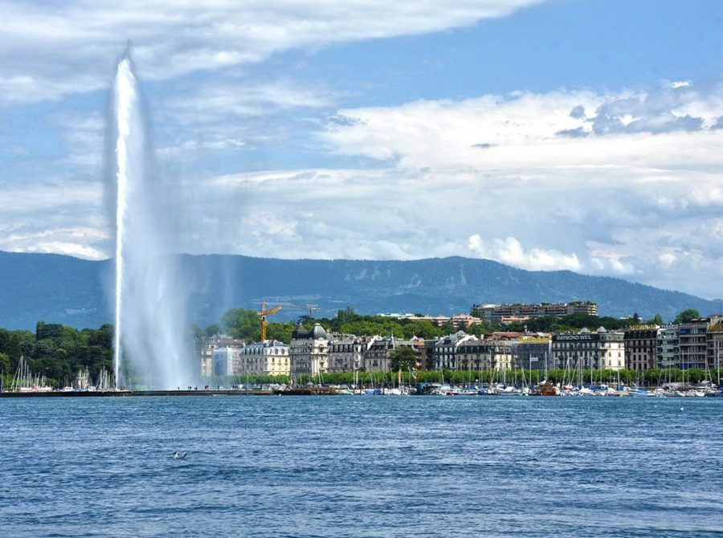

<!-- Each paper is one <li class="pub"> block. Buttons: Abstract, PDF, Presentation.
     To add a talk, add an <li> to the "Presented at" list; &dagger; marks talks given by a coauthor. -->
```{=html}
      <h1 class="page-title">Research</h1>
      <p class="page-lede">International macroeconomics and finance, energy and geoeconomics, and time-series econometrics.</p>

      <h2 class="section">Working papers</h2>
      <ul class="pubs">
        <li class="pub" id="oil-shipping">
          <div class="pub-thumb"></div>
          <div class="pub-body">
            <h3 class="pub-title">Oil Shipping and Pirates<span class="sub">The Macroeconomic Effects of Oil Tanker Attacks</span></h3>
            <p class="pub-authors"><span class="me">Viktor Gradoux</span> and <a href="https://julianmarcoux.github.io/">Julian Marcoux</a> (University of Lausanne)</p>
            <p class="pub-meta">Working paper, October 2026. Draft updated frequently.</p>
            <div class="pub-actions"><button class="btn" data-panel="oil-shipping-abs" aria-expanded="false" aria-controls="oil-shipping-abs">Abstract</button><a class="btn" href="assets/files/Gradoux_Marcoux_Oil_Shipping_and_Pirates.pdf"><svg class="ico" aria-hidden="true" focusable="false" xmlns="http://www.w3.org/2000/svg" viewBox="0 0 576 512"><path fill="currentColor" d="M96 0C60.7 0 32 28.7 32 64l0 384c0 35.3 28.7 64 64 64l80 0 0-112c0-35.3 28.7-64 64-64l176 0 0-165.5c0-17-6.7-33.3-18.7-45.3L290.7 18.7C278.7 6.7 262.5 0 245.5 0L96 0zM357.5 176L264 176c-13.3 0-24-10.7-24-24L240 58.5 357.5 176zM240 380c-11 0-20 9-20 20l0 128c0 11 9 20 20 20s20-9 20-20l0-28 12 0c33.1 0 60-26.9 60-60s-26.9-60-60-60l-32 0zm32 80l-12 0 0-40 12 0c11 0 20 9 20 20s-9 20-20 20zm96-80c-11 0-20 9-20 20l0 128c0 11 9 20 20 20l32 0c28.7 0 52-23.3 52-52l0-64c0-28.7-23.3-52-52-52l-32 0zm20 128l0-88 12 0c6.6 0 12 5.4 12 12l0 64c0 6.6-5.4 12-12 12l-12 0zm88-108l0 128c0 11 9 20 20 20s20-9 20-20l0-44 28 0c11 0 20-9 20-20s-9-20-20-20l-28 0 0-24 28 0c11 0 20-9 20-20s-9-20-20-20l-48 0c-11 0-20 9-20 20z"/></svg>PDF</a><button class="btn" data-panel="oil-shipping-talks" aria-expanded="false" aria-controls="oil-shipping-talks">Presentation</button></div>
            <div class="pub-panel" id="oil-shipping-abs" hidden><p>This paper studies the macroeconomic effects of attacks on oil tankers. We identify oil-shipping-cost shocks by combining a narrative record of attacks on oil tankers along key routes in the Middle East and Southeast Asia with high-frequency changes in tanker freight rates. Focusing on the period following the U.S. shale expansion, we find that these shocks lower economic activity and raise consumer prices in both the United States and the world economy. These responses differ from those associated with conventional oil supply shocks and disruptions to dry-bulk shipping. Especially, crude production and oil prices show no significant immediate response, while inventories decline. Moreover, U.S. evidence points to an energy-trade channel, with increased congestion at Middle Eastern ports, lower crude imports and refinery inputs, leading to higher fuel prices. We also document that manufacturing orders and shipments fall immediately, consistent with precautionary adjustments in firms&rsquo; purchases and investment plans. These findings, together with the contraction in global activity, suggest that oil-shipping disruptions can hurt both oil-importing and oil-exporting economies.</p><p class="kw">Keywords: oil shipping, piracy, high-frequency identification, proxy SVAR, energy security. JEL: E31, E32, F51, Q41, Q43.</p></div><div class="pub-panel" id="oil-shipping-talks" hidden><p class="talks-head">Presented at</p><ul class="talks"><li><span class="talk-year">2026</span><span>University of Lausanne Research Days, ETH Zurich<sup class="dagger">&dagger;</sup> (scheduled)</span></li></ul><p class="talks-note"><sup>&dagger;</sup> Presented by coauthor.</p></div>
          </div>
        </li>
      </ul>

      <h2 class="section">Work in progress</h2>
      <ul class="pubs">
        <li class="pub no-thumb" id="favar-factors">
          
          <div class="pub-body">
            <h3 class="pub-title">The role of latent and observed factors in FAVAR processes</h3>
            <p class="pub-authors"><span class="me">Viktor Gradoux</span>, <a href="https://szgerzensee.ch/about/staff/sylvia-kaufmann">Sylvia Kaufmann</a> (Study Center Gerzensee and University of Basel) and Rodney Strachan (University of Queensland)</p>
            <p class="pub-meta">In progress</p>
            
            
          </div>
        </li>
        <li class="pub no-thumb" id="soe-dfm">
          
          <div class="pub-body">
            <h3 class="pub-title">Small open economy structural dynamic factor model with data scarcity</h3>
            <p class="pub-authors"><span class="me">Viktor Gradoux</span> and Mathieu Grob&eacute;ty (Swiss Institute of Applied Economics, CREA)</p>
            <p class="pub-meta">In progress</p>
            
            
          </div>
        </li>
      </ul>

      <h2 class="section" id="policy">Policy work</h2>
      <ul class="pubs">
        <li class="pub" id="geneve">
          <div class="pub-thumb"></div>
          <div class="pub-body">
            <h3 class="pub-title">Gen&egrave;ve est-il un canton attractif&nbsp;?<span class="sub">Une analyse &eacute;conomique sous l&rsquo;angle de cinq th&eacute;matiques</span></h3>
            <p class="pub-authors"><span class="me">Viktor Gradoux</span> and Mathieu Grob&eacute;ty (CREA)</p>
            <p class="pub-meta">Study commissioned by the Fondation pour l&rsquo;attractivit&eacute; du canton de Gen&egrave;ve, May 2023. In French.</p>
            <div class="pub-actions"><button class="btn" data-panel="geneve-abs" aria-expanded="false" aria-controls="geneve-abs">Abstract</button><a class="btn" href="https://www.unil.ch/files/live/sites/crea/files/etudes-conjoncturelles-sectorielles/analyses-thematiques/Attractivit%C3%A9%20du%20canton%20de%20Gen%C3%A8ve_CREA_2023M05.pdf">Report</a><a class="btn" href="https://www.unil.ch/files/live/sites/crea/files/Documents/Analyses%20%C3%A9conomiques/Etudes%20sur%20l%27%C3%A9conomie%20suisse%20ou%20r%C3%A9gionale/flag_resume_etudeattractivite_geneve.pdf">Summary</a><a class="btn" href="https://geneve-attractive.ch/sites/default/files/source/docs/crea_attractivite_geneve_rapport_20230503.pdf">Press release</a></div>
            <div class="pub-panel" id="geneve-abs" hidden><p lang="fr">Cette &eacute;tude analyse l&rsquo;attractivit&eacute; du canton de Gen&egrave;ve sous l&rsquo;angle des finances publiques, de la fiscalit&eacute;, de l&rsquo;innovation, de la durabilit&eacute; et des infrastructures. L&rsquo;attractivit&eacute; est mesur&eacute;e par un grand nombre d&rsquo;indicateurs &eacute;conomiques et &agrave; l&rsquo;aide d&rsquo;outils macro&eacute;conom&eacute;triques, et compar&eacute;e &agrave; celle des concurrents directs &agrave; l&rsquo;&eacute;chelle nationale (Vaud, Zoug, Zurich et B&acirc;le).</p></div>
          </div>
        </li>
      </ul>
```
